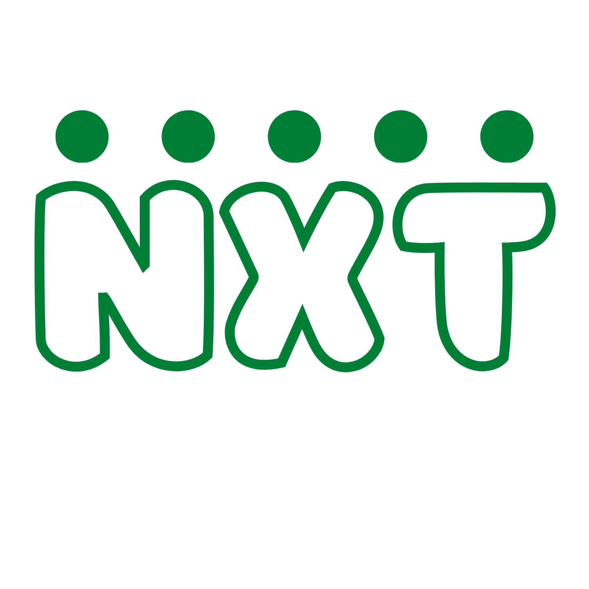

    

<h1 align="center" style="display: block; font-size: 2.5em; font-weight: bold; margin-block-start: 1em; margin-block-end: 1em;">

  <strong>NxT Learn</strong>

</h1>

---

---

## Introduction

**[NxT Learn](https://sulu.io/)** is an open source E-Learning platform that relies on the learner guided education philosophy. NxT learn focuses on overcoming the traditional learning strategies such as exams at the end of the module but rather offers learners skill-based projects during the module and after the module.

Have a look at the official [NxT Learn](nxt-learn.vercel.app) for a comprehensive list of Sulu's features, core values and use cases.

If you want to join the NxT learn as a learner or an instructor you can join us **[here.](nxt-learn.vercel.app)**. If you want to help us maintain the core architecture of the NxT learn project you can also join us **[here](https://github.com/MokuaEnock/NxT-learn)** for a complete step-by-step guide on how you can develop with us.

---

## Table of contents

- [Project Status](#project-status)
- [Introduction](#introduction)
- [Table of contents](#table-of-contents)
- [Motivation](#motivation)
- [More than embedded](#more-than-embedded)
- [Composition](#composition)
- [Software build](#software-build)
- [Software integration](#software-integration)
  - [Mulitcast router](#mulitcast-router)
  - [Logging service](#logging-service)
  - [Development](#development)
- [Use cases and benefits](#use-cases-and-benefits)
  - [Distributed solution](#distributed-solution)
  - [Driverless devices](#driverless-devices)
  - [Real-time solutions](#real-time-solutions)
  - [Digital twin](#digital-twin)
  - [Simulation and test automations](#simulation-and-test-automations)
- [Examples](#examples)
- [Licensing](#licensing)
- [Call for action](#call-for-action)

---

## Motivation

Traditional avenues for education are resource intensive and have been criticized for a long time for not allowing room for differently-abled learners to explore their options, this has led to education rewarding individuals who are good at cramming and not necessarily at problem-solving. The crammers after completing their education and being released into the world are faced with very different problems that do not require cramming.

The NxT learn was implemented to overcome these challenges it seeks to change the avenues of education by implementing the following.

1. **Project-based** - Learners doing real world projects throughout the course and after the course.

2. **Learner-centered** - Learning is student-centered and learners solve challenges within themselves and only have access to the instructor when they face a blocker. The instructor only guides the learner through motivation and rewards.

---

## 👨‍💻 Tech stack

Here's a brief high-level overview of the tech stack the NxT project uses:

- This project uses **[Raect Js](https://reactjs.org/)** as the frontend framework.
-
- The styling of the project has been done using custom pure CSS3 and it is encouraged for any future contribution this will be the default styling language.
- The uses JSON for data handling.
-  🚨 Currently, the app is still in development and more features will be added in the coming week.
- The app uses the font ["Chakra Petch"](https://fonts.googleapis.com/css2?family=Chakra+Petch&display=swap) as its main font, and the design of the app adheres to the material design guidelines.

---
# ✍️ Contributing

Interested in contributing to the Well app project? Thanks so much for your interest! We are always looking for improvements to the project and contributions from open-source developers are greatly appreciated.

---

# 🌟 Spread the word

If you want to say thank you and/or support the active development of the Well app:

- Add a GitHub Star to the project!
- Tweet about the project on your Twitter!
  - Tag [@254_enok\_](https://twitter.com/254_enok_) and/or `#NxTLearn`

---

## Licensing

The NxT Learn is an open-source platform and everyone can learn and contribute to its development, it is licensed under the GNU General Public License v3.0. All designs were created by [Enock Mokua](https://github.com/MokuaEnock) and distributed under a Creative Commons license (CC BY-SA 4.0 International).

    

